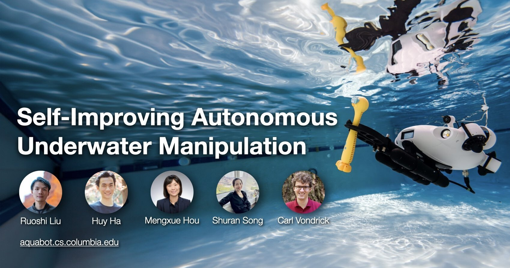

<p align="center">
  
</p>

### In Submission 2024
### [Project Page](https://aquabot.cs.columbia.edu/)  | [Paper](https://ruoshiliu.github.io/resources/aquabot.pdf) | [Video](https://aquabot.cs.columbia.edu/assets/videos/icra_supp_final.mp4) | [Code](https://github.com/cvlab-columbia/aquabot)

[Self-Improving Autonomous Underwater Manipulation](https://aquabot.cs.columbia.edu/)  
 [Ruoshi Liu](https://ruoshiliu.github.io/)<sup>1</sup>, [Huy Ha](https://www.linkedin.com/in/junbangliang/)<sup>1,2</sup>, [Mengxue Hou](https://www.mengxuehou.com/)<sup>3</sup>, [Shuran Song](https://shurans.github.io/)<sup>1,2</sup>, [Carl Vondrick](https://www.cs.columbia.edu/~vondrick/)<sup>1</sup> <br>
 <sup>1</sup>Columbia University, <sup>2</sup>Stanford University, <sup>3</sup>University of Notre Dame

## Hardware Setup
Here's a minimal shopping list to reproduce our setup:

- Robot: [QYSEA FIFISH V-EVO](https://store.qysea.com/fifish-v-evo.html) ($1599)
- Fishing Camera: https://a.co/d/dYumbWQ ($170)
- 3D Printer (optional): [Bambu Lab P1S](https://us.store.bambulab.com/products/p1s?variant=42153262743688&currency=USD&utm_medium=product_sync&utm_source=google&utm_content=sag_organic&utm_campaign=sag_organic&gad_source=1&gclid=Cj0KCQjwmt24BhDPARIsAJFYKk3YCVxsSwEl0RNko1cFlSil5XzdDir5UY9je2N1FGthGgrWJJnZAKIaAlrPEALw_wcB) ($550)
- Camera Base:  [Onshape-Project](https://cad.onshape.com/documents/fa17da090f7aaf212b684a17/w/90f33a6a51457a06cd56540d/e/ea42e7c53347be446ba67cbf?renderMode=0&uiState=6717f62abcfd9172e547272b) | [STL File](resources/camera-base.stl)
- Camera Mount: [Onshape Proejct](https://cad.onshape.com/documents/720b547ac66be2e3e2f0bfc1/w/933ca8e0da7cb8fe52c88099/e/e83c920b97c6a1bdf4fe603d?renderMode=0&uiState=6717f6cd3be4ee27e5b032ef) | [STL File](resources/camera-base.stl) (adjust sketch 3 to adjust for the camera tilting angle)
- Video Capture Card: [ACASIS PCIe](https://a.co/d/6ba8I1W) ($280)
- Software SDK: [QYSEA DEVELOPER FOR V-EVO](https://www.maverickdrone.com/products/qysea-developer-for-v-evo?_pos=2&_sid=5bf6cc593&_ss=r) ($1500)
- Xbox Controller: https://a.co/d/3gXYJjS ($50)
- Zip Ties: [long](https://a.co/d/095D0Q5) (fixing camera base against robot body) | [short](https://a.co/d/7DrU5aa) (fixing camera base against the tail)
- Thruster Protector (optional): https://a.co/d/5iKOb5P ($50)

### Regarding Robot:
We used the V-EVO robot which is the cheapest model which can be purchased from major resellers in the U.S. such as [B&H](https://www.bhphotovideo.com/c/product/1762635-REG/qysea_yr010bc94002430_fifish_v_evo_ai_rov.html) and [amazon](https://a.co/d/e9Uquqc). The battery of this model lasts around 2-6 hours depending on motor speeds and we purchased 2 of them to avoid downtime during experimentation. If continuos undisturbed operation is impirical, consider purchasing [V6-Expert](https://store.qysea.com/fifish-v6-expert.html) with [OPSS](https://store.qysea.com/onshore-power-supply-system-opss.html). These could also be found on [B&H](https://www.bhphotovideo.com/c/product/1662670-REG/qysea_yr010bc94002409_fifish_v6_expert_mp200.html). As confirmed by QYSEA, V-EVO and V6-expert have identially motor and low-level controller, but we have not tested V6 in this project.

### Regarding Camera
we chose a cheap fishing camera on amazon for visual input.

Pros:
- The camera itself is very well-built and robust. During experiments, we have tried streaming multiple cameras 24/7 underwater over the course of multiple days without issue.
- The camera has a wide field of view even underwater.
- The latency of the camera is around 100ms.

Cons:
- The fishing camera (linked above) we purchased has a relatively low quality control. We have noticed the camera field of view being shifted across two different cameras (same model). This will likely prevent policy transfer across different cameras.
- The camera body doesn't have any indicator sign suggesting the upright direction, requiring manual calibration.

### Regarding Software SDK
QYSEA provides a software SDK to control the robot through a wired or wireless connection. You can find a documentation here: https://docs.qysea.com/qysea_sdk/#/en/README. This is a proprietary software that you need to purchase from QYSEA. It provides neccessary APIs for visuomotor control.

### Regarding I/O
We use a video capture card (linked above) with PCIe connection to a desktop to real-time capture and process the camera inputs. At the very least, one fishing camera should be mounted on the robot body. In addition, we also mounted 2 additional cameras at the corners of the swimming pool to localize the robot's 3D position in the pool for navigation purposes.

### Regarding Computer
We ran all policy deployment and demonstration data collection on a desktop with AMD Threadripper 7970X CPU, 2xA6000 GPU, 192GB DDR5 RAM, and NVMe storage, with Ubuntu 20.04.6 LTS. Our setup is on the higher end, but we expect a consumer-grade CPU and GPU to be able to support real-time policy inference as well. Receiving and preprocessing multiple streaming cameras can be CPU-intensive which we observed. Offloading the preprocessing of videos to GPU will significantly reduce requirements on the CPU.

### Tips
- The underwater robot is tethered, and the wire will get tangled by the robot body or its thrusters, this could be very annoying at times. We suggest tieing ping pong balls to the robot wire so the wire floats on the surface of the water (as seen in our videos).
- DO NOT leave the fishing camera on and under the sunlight for extended period of time due to the potential of overheating. Leaving underwater is fine.
- Covering the thrusters with protector (linked above) helps prevents entanglement.
- [Blue Skies Drones](https://www.blueskiesdroneshop.com) has a ton of components needed to potentially repair a problematic robot (e.g. broken motor fins, plastic shell).

## Software Setup

#### Environment
Our setup uses [miniforge](https://github.com/conda-forge/miniforge) and CUDA 12.2. Please install with:

    mamba env create -f aquabot.yaml

#### Demonstration Collection

    python qysea_collect_demo.py
This script assums a system with 64 CPU threads so it uses
- 32 threads for sending and receiving data from the robot through the SDK
- 28 threads for camera I/O
- 4 threads for recording sensor data from the robot (water depth, IMU, compass)

Seperating these threads into 3 independent processes was neccessary since otherwise the robot I/O and camera I/O tend to interfeer with each other, creating varrying latency during demonstration collection. Seperating them in seperate threads with `subprocess` resolves the issue.

Once demonstration data is collected, it should follow this structure:
```
demo_data/
│
├── episode_001/
│   ├── action/              # Contains .npy files with timestamp-based names
│   │   ├── 22246576.npy
│   │   └── ... (many more .npy files with similar timestamp patterns)
│   │
│   ├── cctv_left/           # Contains .jpg files from the left camera
│   │   ├── 22246571.jpg
│   │   └── ... (many more .jpg files with similar timestamp patterns)
│   │
│   ├── cctv_right/          # Contains .jpg files from the right camera
│   │   ├── 22246572.jpg
│   │   └── ... (many more .jpg files with similar timestamp patterns)
│   │
│   ├── rov_main/            # Contains .jpg files from the main ROV camera
│   │   ├── 22246574.jpg
│   │   └── ... (many more .jpg files with similar timestamp patterns)
│   │
│   ├── rov_mount/            # Contains .jpg files from the mounted ROV camera
│   │   ├── 22246577.jpg
│   │   └── ... (many more .jpg files with similar timestamp patterns)
│   │
│   ├── status/              # Contains .json status files with timestamp-based names
│   │   ├── 22247039.json
│   │   └── ... (many more .json files with similar timestamp patterns)
│
├── episode_002/
│   └── ... (follows the same structure as episode_001)
├──...
```
Note that `cctv_left`, `cctv_right`, and `status` folders are optional for policy training but can be very useful for other things such as localization, analysis, or visualization. `status` contains proprioceptive data such as compass, IMU, depth that could be useful as policy input but not used in this project.

#### Policy Training
After demonstration data is collected, you can use the following command to train a robot policy
```
cd policy
python train.py
--root_dir ../fifish-vevo/rov_control/demo_data
--num_epochs 200
--n_obs 2
--n_pred 4
--interval 100
--batch_size 32
--learning_rate 0.0001
--weight_decay 0.1
--loss_function mse
--obs_interval 300
--seperate_encoder
```
This script uses a simple MLP as the action decoder of the policy. This can be replaced by a diffusion policy or action-trunked transformer (ACT).

#### Policy Deployment
Once a policy is trained, you can deploy the policy. You need to first run the [`qysea_xbox_subprocess.py`](fifish-vevo/rov_control/qysea_xbox_subprocess.py) which is a python process to control the robot. Once this process is successfully run, you can then run [`qysea_deploy.py`](fifish-vevo/rov_control/qysea_deploy.py) for policy inference. During policy rollouts `qysea_deploy.py` will send policy output (actions) to `qysea_xbox_subprocess.py` through a pipe connection in pickled packets.
```
python qysea_xbox_subprocess.py
python qysea_deploy.py
```
Once both scripts are up and running, you can press `m` and `a` on the keyboard to switch between manual control (`m`) and policy control (`a`).

#### Self Learning (Optional)
Once a policy is learned, you can run [`self_learn.py`](fifish-vevo/rov_control/self_learn.py) to perform self learning of the robot's speed profile for a predefined task and reward.

#### Localization and Navigation (Optional)
Under [`object_detection`](fifish-vevo/object_detection) and [`camera_control`](fifish-vevo/camera_control), you can find our code for:
- Stereo-calibrate both the intrinsics and the extrinsics of the external cameras
- Capture data from cameras to create training data
- Generate a synthetic data for training an underwater robot object detector
- Training an real-time underwater robot detector based on FasterRCNN implemented by MobileNetV3
- Triangulation of detected robot bounding boxes to calculate 3D coordinates of the robot

These features are used to perform real-time localization and navigation of the robot during inference time if needed (e.g. during garbage sorting experiment, resetting the position of the robot after a garbage is successfully placed into a bin).

## TODO

 - [ ] Release training and inference code of ACT and Diffusion Policy
